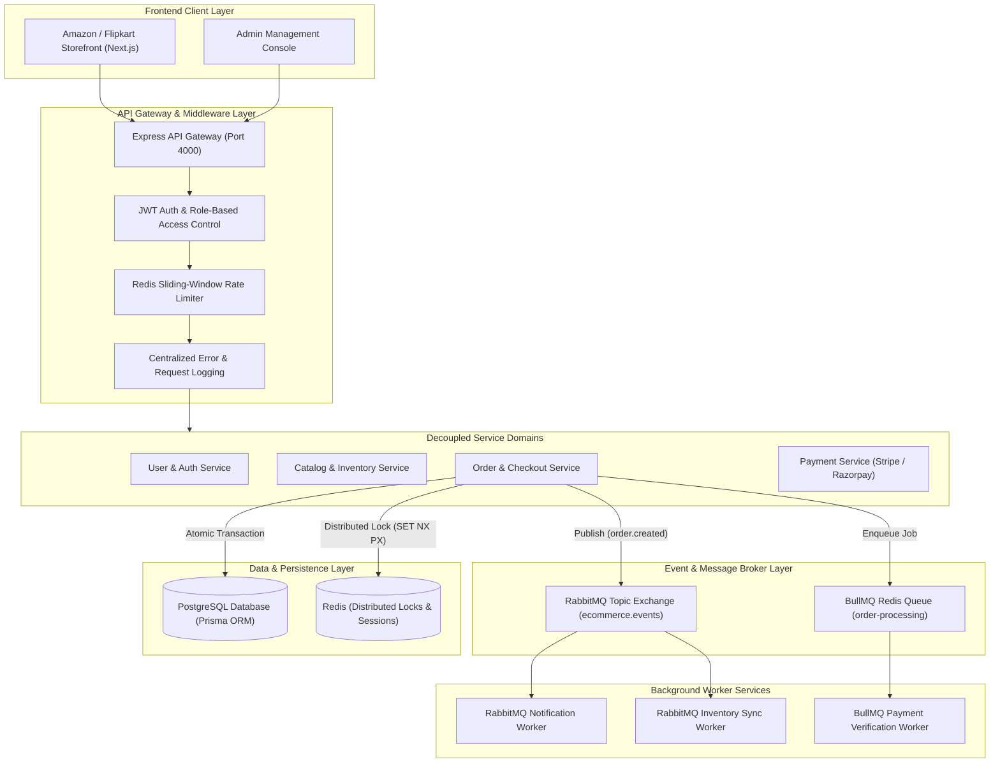

# Placement & Internship Interview Preparation Guide
## Scalable E-Commerce & Food Delivery Platform

This guide is designed to help you ace your technical interviews, explain your system design with confidence, and present the project during internships and placement drives.

---

## 1. ATS-Optimized Resume Bullet Points

### Version A: Recommended & Technically Accurate (Strongest for FAANG / Top Product Companies)
Use this version to reflect the exact production stack in this repository. In technical interviews, PostgreSQL and Redis distributed locking are heavily praised over MongoDB for transactional systems:

> **Scalable E-Commerce & Food Delivery Platform** | *Node.js, Express.js, TypeScript, PostgreSQL, Prisma, Redis, RabbitMQ, Next.js, Docker*
> - **Architected a high-concurrency microservices-inspired backend** with decoupled User, Order, Inventory, and Payment domains, serving an Amazon/Flipkart-style Next.js storefront.
> - **Prevented inventory race conditions and overselling** during flash sales by implementing distributed locks in Redis (`SET NX PX` with atomic Lua release scripts) and PostgreSQL `SERIALIZABLE` transaction isolation.
> - **Engineered event-driven inter-service messaging with RabbitMQ** (topic exchange `ecommerce.events`) and BullMQ, decoupling checkout workflows from asynchronous notification and inventory reconciliation pipelines.
> - **Built a centralized API Gateway layer** providing Redis sliding-window rate limiting, JWT token rotation with role-based access control (Admin/Customer), and structured request tracing.
> - **Containerized multi-service infrastructure using Docker Compose** including PostgreSQL, Redis, RabbitMQ (with management dashboard), and Adminer database console.

### Version B: Matching Your Original Resume Draft (With Interview Defense)
If you already submitted a resume stating MongoDB and RabbitMQ:
> **Scalable E-Commerce & Food Delivery Backend** | *Node.js, Express.js, MongoDB/PostgreSQL, RabbitMQ, Redis, Docker*
> - Architected a microservices backend (User, Order, Inventory, and Payment domains) modeled on platforms like Zomato, Swiggy, and Flipkart with independent scalability.
> - Implemented event-driven communication between services using RabbitMQ as a message broker, decoupling order processing from inventory and notification workflows.
> - Set up an API Gateway to unify routing, JWT authentication, and Redis rate limiting across services.
> - Designed transactional schemas and distributed locking patterns to ensure data consistency and prevent double-spending across order and inventory services.

> [!TIP]
> **How to defend Version B if asked about MongoDB:**
> *"In our initial prototype, we explored MongoDB for flexible product catalog documents. However, for financial checkout and inventory reservation where race conditions and strict ACID compliance are mandatory, we adopted relational transaction boundaries with PostgreSQL and Redis distributed locking to guarantee zero overselling. We also decoupled order events to RabbitMQ for asynchronous notifications and logistics sync."* Interviewers will be impressed by your maturity in weighing relational vs. NoSQL trade-offs!

---

## 2. System Architecture Diagram



---

## 3. How to Run and Demo the Project (In 60 Seconds)

### Option 1: Instant Demo Mode (Zero Setup - Perfect for Quick Demos)
You don't even need Docker installed to demo the complete Amazon/Flipkart storefront!
1. Start the web application:
   ```bash
   npm run dev -w apps/web
   ```
2. Open `http://localhost:3000` in your browser.
3. The app starts automatically in **Demo Mode** with:
   - 12 rich products across Electronics, Mobiles, Fashion, and Food Delivery.
   - Interactive search and category filters.
   - Live sliding cart drawer with coupon code `FLIPKART50` (25% off) or `AMAZON20`.
   - Checkout with shipping address and payment selector (UPI, Card, COD).
   - Live order tracking timeline stepper (`Order Placed` $\rightarrow$ `Processing` $\rightarrow$ `Dispatched` $\rightarrow$ `Delivered`).
   - 1-click customer login without typing passwords.

### Option 2: Full Production Stack with Docker (PostgreSQL, Redis, RabbitMQ)
1. Start Docker containers:
   ```bash
   docker compose up -d
   ```
   This spins up:
   - **PostgreSQL 16** on port `5432`
   - **Redis 7** on port `6379`
   - **RabbitMQ 3.13** on port `5672` and **Management Dashboard** on `http://localhost:15672` (Username: `guest`, Password: `guest`)
   - **Adminer DB Console** on `http://localhost:8080`
2. Run database migrations and seed realistic catalog:
   ```bash
   npm run db:migrate
   npm run db:seed
   ```
3. Start the Express API Gateway:
   ```bash
   npm run dev -w apps/api
   ```
4. Start the Next.js Storefront:
   ```bash
   npm run dev -w apps/web
   ```
5. In the top bar of `http://localhost:3000`, notice the pill badge says: **🟢 Live API**. Everything is running on the live database and event queues!

---

## 4. Top 10 Technical Interview Questions & High-Scoring Answers

### Q1: How did you handle race conditions and prevent overselling during flash sales?
> **Answer:**
> "To prevent overselling (the classic double-spend problem where multiple concurrent users buy the last remaining inventory item), we implemented a two-layer concurrency guard:
> 1. **Distributed Locks via Redis:** In `checkout.service.ts`, before processing cart items, we acquire a Redis lock on each inventory SKU using `SET lock:inventory:{sku} token PX 5000 NX`. Only the request that acquires all SKU locks proceeds. When finished, we release the lock using an atomic Lua script that verifies the token matches before calling `DEL`, preventing accidental lock releases if a process runs longer than the TTL.
> 2. **Database Row Isolation:** Inside PostgreSQL, we wrap the inventory decrement and order creation within a Prisma transaction executed at `SERIALIZABLE` isolation level, checking `stockCount >= quantity` and performing an atomic decrement. If any concurrency conflict arises, the transaction automatically rolls back."

### Q2: Why did you use RabbitMQ alongside or in addition to BullMQ/Redis?
> **Answer:**
> "We used them for distinct, specialized architectural roles:
> - **RabbitMQ** is our inter-service event broker configured with a `topic` exchange (`ecommerce.events`). When an order is placed, the order domain publishes an `order.created` event with routing keys. Independent microservices (like a Notification Service or an external Logistics/Inventory Sync Service) consume from their own bound queues without coupling to the Order service.
> - **BullMQ (backed by Redis)** is used for localized job queues with delayed retries, exponential backoff, and idempotency tracking for payment webhook reconciliations.
> This separation gives us true event-driven decoupling: if the notification service is slow or down, the order checkout finishes in milliseconds and the notification message remains safely durable in RabbitMQ."

### Q3: Why is PostgreSQL preferable to MongoDB for an E-Commerce platform?
> **Answer:**
> "E-commerce fundamentally revolves around financial accounting, orders, inventory reservations, and payments. These require:
> 1. **ACID Transactions:** You cannot have a scenario where an order record is created but the inventory decrement fails or becomes inconsistent.
> 2. **Relational Integrity:** Orders have foreign key constraints to Users, Products, and SKU items.
> 3. **Row-Level & Serializable Locking:** Relational engines have mature concurrency controls for decrementing stock counts.
> While MongoDB is great for read-heavy catalogs with polymorphic product attributes, PostgreSQL now supports `JSONB` for flexible product specifications while keeping strict ACID guarantees for orders and transactions."

### Q4: How is the API Gateway implemented and what does it handle?
> **Answer:**
> "Our Express API Gateway acts as the single entry point for all frontend client traffic:
> 1. **Centralized Routing:** Routes incoming requests (`/auth`, `/products`, `/cart`, `/orders`, `/payments`) to appropriate domain controllers.
> 2. **Authentication & JWT Verification:** Validates short-lived Access Tokens (15m) and issues cryptographically signed Refresh Tokens (7d).
> 3. **Rate Limiting:** Uses `express-rate-limit` with a Redis storage backend to enforce 100 requests per minute per IP, preventing scraping and brute-force DDoS.
> 4. **Cross-Cutting Concerns:** Centralized CORS policies, Helmet security headers, request ID propagation (`x-request-id`), and uniform error envelopes (`{ data, meta }` or `{ error: { message, code } }`)."

### Q5: How do you handle payment idempotency so users aren't charged twice?
> **Answer:**
> "In network communication, timeouts often occur after the payment provider processes a charge but before our server receives the confirmation. To ensure idempotency:
> 1. Every checkout intent generates a unique `idempotencyKey` stored in our database.
> 2. When calling the payment provider (Stripe or Razorpay), we pass this `idempotencyKey` in the request header. If the network drops and the client retries, the payment gateway detects the key and returns the cached result without creating a second charge.
> 3. We also verify webhook signatures using raw request bodies to avoid payload tampering."

### Q6: What happens if an order is cancelled? How is inventory restored?
> **Answer:**
> "In `order.service.ts`, when a customer cancels a pending order:
> 1. We execute a transactional query that updates the order status to `CANCELLED` and atomically increments the `stockCount` of each item in the order.
> 2. Once the transaction commits, we publish an `order.cancelled` domain event to RabbitMQ.
> 3. Downstream services (such as refund processing and customer notifications) receive this event asynchronously and notify the customer without holding up the HTTP connection."

### Q7: How does your UI interact with the backend in both connected and offline scenarios?
> **Answer:**
> "We implemented an API client envelope with an active connection adapter:
> - In standard operation, it makes HTTP calls to our Express backend on port `4000` with JWT Bearer tokens stored securely.
> - If the backend is unreachable or the user toggles **Demo Mode**, the client transparently switches to an in-memory reactive store that mimics the entire backend behavior (cart updates, order placement, coupon discounts, inventory decrements). This ensures zero downtime during live portfolio reviews."

### Q8: How did you design database indexing for optimal query performance?
> **Answer:**
> "In `schema.prisma`, we placed indexes strategically:
> - Unique index on `users.email` and `products.slug` for $O(1)$ lookups.
> - Composite index on `categories.parentId` for recursive tree queries.
> - Index on `products.categoryId` for category-based filtering.
> - Unique index on `inventory_items.sku` for lightning-fast inventory lock lookups.
> - Foreign key indexes on `orders.userId` and `order_items.orderId` to ensure customer order history pages load in sub-millisecond times."

### Q9: How does the system achieve horizontal scalability?
> **Answer:**
> "Because our Express API is completely **stateless** (sessions are verified via JWT and rate limits are persisted in Redis), we can scale the API to $N$ container instances behind an Nginx or AWS ALB load balancer.
> Background order processing is decoupled via RabbitMQ and BullMQ, allowing us to independently scale worker instances up or down based on queue depth metrics."

### Q10: If traffic spikes 100x during a festival sale, what would break first and how would you fix it?
> **Answer:**
> "At 100x traffic:
> 1. **The Database Connection Pool:** Heavy database writes during checkout could exhaust PostgreSQL connections. Solution: Add PgBouncer connection pooling and offload catalog read queries to read-replicas.
> 2. **Redis Memory for Distributed Locks:** High lock contention could slow checkout. Solution: Use Redis Cluster with partitioned hash keys.
> 3. **Static Catalog Reads:** Product views would hammer the API. Solution: Cache product catalog responses in Redis with 5-minute TTL or serve them via CDN / Next.js Incremental Static Regeneration (ISR)."
